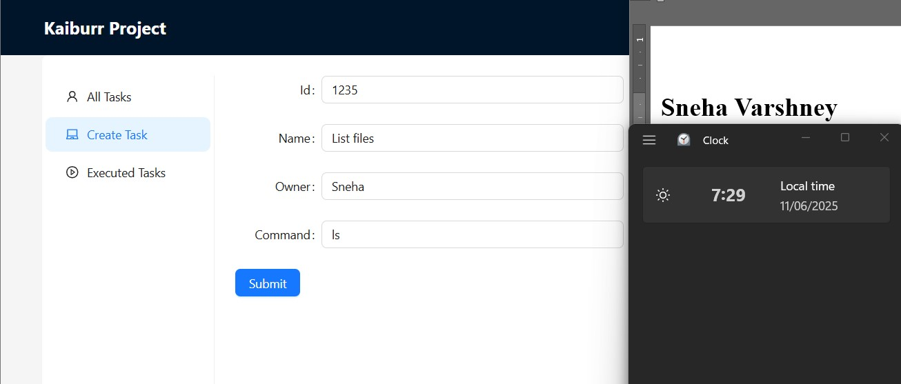
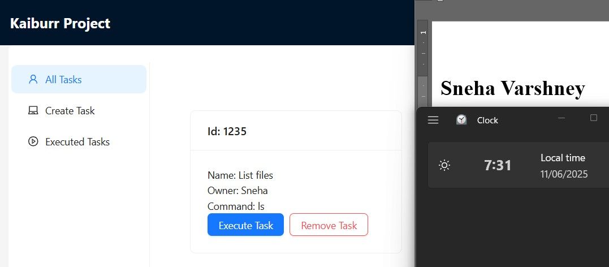
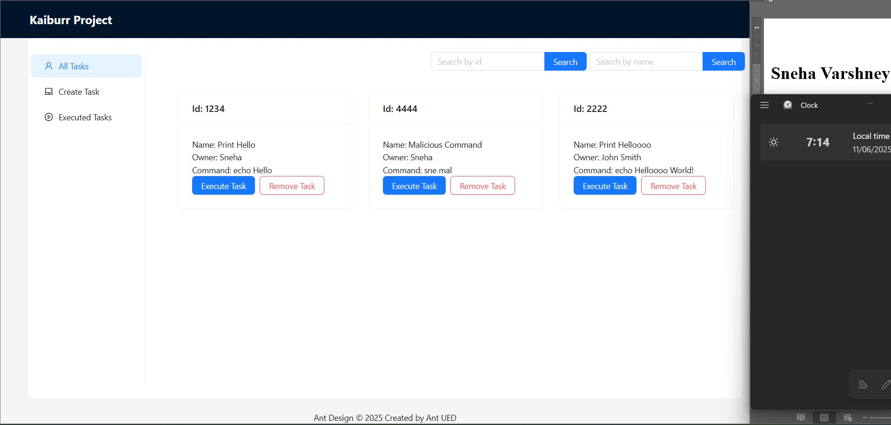
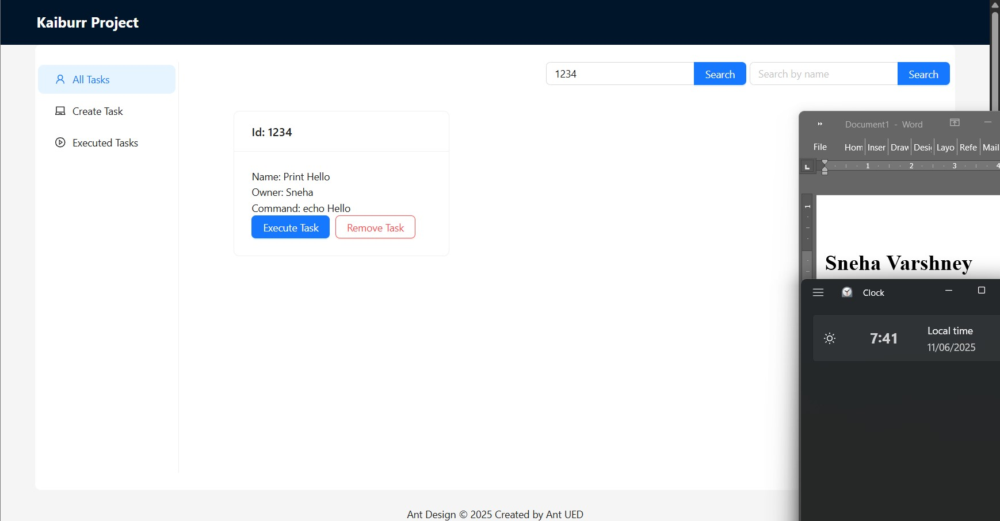
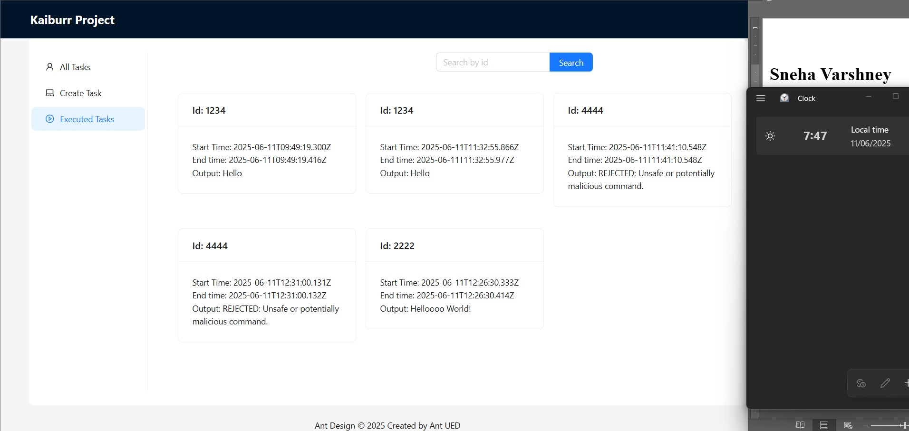
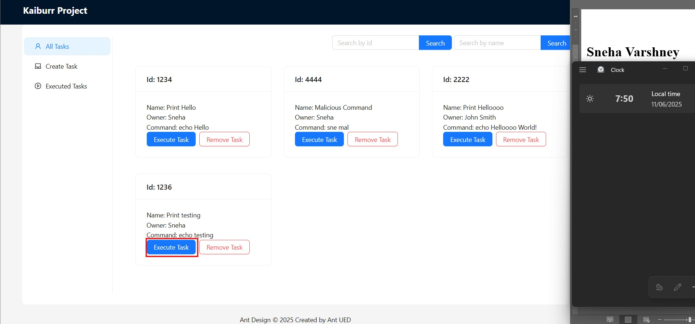
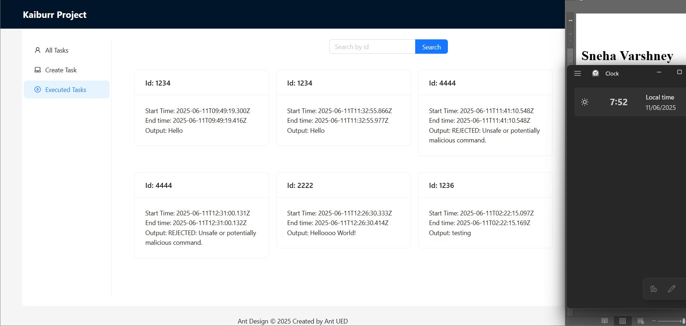

# Kaiburr Frontend

A React-based frontend application for interacting with the Kaiburr Task Management System.
---
## 🚀 Features

- ✨ Create and store new tasks
- 📋 View all tasks in a clean interface
- 🔍 Search tasks by ID or name
- ⚡ Execute shell commands stored in tasks
- 🗑️ Delete tasks
---

## 🛠️ Tech Stack

- React.js
- Axios (API calls)
- Ant Design (UI components)
---

## 🛠️ Setup Instructions

### 1. Clone the Repository
```bash
git clone https://github.com/varshneysneha-08/kaiburr_frontend.git
cd kaiburr_frontend
```

### 2. Configure Environment Variables

Create a `.env` file in the root directory with the following content:

```bash
REACT_APP_API_BASE_URL=http://your-backend-api-url
```

### 3. Install Dependencies
bash
npm install
### 4. Run the Application
```bash
npm start
The application will open in your browser at http://localhost:3000.
```
---

## 📸 Screenshots & Examples

### 1. Create New Task
**Endpoint:** `POST /api/tasks/save`  
**Description:** Save a new task with command details  
| Submitting Form | Output Card |
|-----------------|------------|
| <div>  </div> | <div>  </div> |

---

### 2. View All Tasks 
**Endpoint:** `GET /api/tasks/get`  
**Description:** Retrieve complete task list  
**Response Examples:**
<div>
  
</div>

---

### 3. Fetch Specific Task
**Endpoint:** `GET /api/tasks/get/{id}`  
**Description:** Retrieve single task by ID  
**Examples:**
<div>

</div>

---

### 4. Execute Task Command
**Endpoint:** `PUT /api/tasks/execute/{id}`  
**Description:** Run the command associated with a task  
**Execution Flow:**

1. Before Execution  
   <div>
      
    </div>

3. Execution Button
    <div>
      
    </div>

2. After Execution  
    <div>
      
    </div>
- Command output captured
- Execution timestamp recorded
- Result appended to task history

---

## 🔗 API Integration

| Endpoint                | Method | Description                          |
|-------------------------|--------|--------------------------------------|
| `/api/tasks/save`       | POST   | Create a new task                    |
| `/api/tasks/get`        | GET    | Get all tasks                        |
| `/api/tasks/get/{id}`   | GET    | Get task by ID                       |
| `/api/tasks/getbyname/` | GET    | Search tasks by name                 |
| `/api/tasks/execute/`   | PUT    | Execute a task's command             |
| `/api/tasks/deleteById/`| DELETE | Delete a task                        |

---

## 👩💻 Author
Sneha Varshney  | 📅 Date Generated: 12-June-2025

